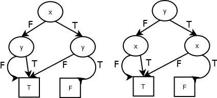

Робота №04
----------

*Орієнтовані графи*

Орієнтований граф G = (V, E) складається зі скінченної множини вершин V
= {v~0~, v~1~, ...,v~m~} та скінченної множини ребер E = {e~1~, e~2~,
..., e~n~}. Кожне ребро -- це пара вершин (v,w). По ребру (v,w) можна
пройти від вершини v до вершини w. Орієнтований граф може мати петлі,
ребра виду (v,v), і не являється мультиграфом, тобто з одної вершини до
іншої можна перейти не більше ніж по одному ребру.

{width="3.21875in"
height="1.4270833333333333in"}

*Маршрут* (*шлях*) в графі -- це список ребер \[(v~0~, v~1~), (v~1~,
v~2~), (v~2~, v~3~), ..., (v~k-1~, v~k~)\], що веде з початкової вершини
v~0~ в кінцеву v~k,~ в подальшому позначається як список вершин \[v~0~,
v~1~, ..., v~k~\]. *Довжина шляху* -- кількість реберг k. *Ланцюг* -
маршрут, у якого ребра попарно різні. *Простий ланцюг* - маршрут, у
якого вершини попарно різні. *Цикл* - замкнений маршрут v~0~==v~k~.
*Простий цикл (контур)* - замкнений простий маршрут. Контур, що містить
всі вершини графу, *- гамільтоновий*.

{width="2.34375in"
height="1.9791666666666667in"}

Турнір -- це граф у якого довільні дві вершини з\`єднані рівно одним
ребром. (Мал.2)

Граф G = (V,E) - транзитивний, якщо для довільних двох ребер (v,u) ϵ E і
(u,w) ϵ E, то (v,w) ϵ E. Для довільного орієнтованого графа E можна
побудувати мінімальний транзитивний граф E^\*^, підграфом якого є граф
E. Граф E^\*^ називається транзитивним замиканням графа E. Граф на Мал.4
є транзитивне замикання графа на Мал.3.

Граф ациклічний або безконтурний, якщо він немає жодного циклу.
Ациклічний граф не може мати петлі.

{width="2.4479166666666665in"
height="1.4583333333333333in"}Топологічне сортування графа G = (V, E),
це розташування всіх його вершин в такому порядку \[v~0~, v~1~, ...,
v~m~\], що якщо (v~i~,v~j~) ϵ E, то вершина v~i~ в списку лівіше вершини
v~j\ ,~ тобто \[\...,v~i~,...,v~j~ ...\]. Список \[0,1,2,3,4\] --
топологічне сортування графа на Мал.1. Топологічне сортування можливо
лише для ациклічного графу.

{width="2.6145833333333335in"
height="1.6145833333333333in"}В роботі розглядаються орієнтовані графи,
вершини яких цілі числа від 0 до m - 0..m.

Для представлення графа (дані типу Graph) використовуються списки
суміжності. Граф з (m+1) вершиною -- це список довжини (m+1), i-ий
список (0≤i≤ m) -- це список всіх вершин графа, суміжних з вершиною i.

***type*** Graph = \[\[Int\]\]

Список gr1 задає орієнтований граф (Мал.1) gr1 = \[\[1,2,3\], \[2,3\],
\[3,4\], \[4\],\[\]\] .

На основі допоміжного файлу, котрий включає визначення типів і тестових
даних, створити файл, в якому надати визначення наступних функцій.

1.  Предикат isGraph gr, що перевіряє чи задає список gr типа Graph
    орієнтований граф.

    -   *isGraph gr4 = True*

    -   *isGraph \[\[1,2,2\],\[\],\[1\]\] = False*

2.  Предикат *isTournament gr*, що перевіряє чи являється орієнтований
    граф gr турніром.

    -   *isTournament gr1 = False*

    -   *isTournament gr2 = True*

3.  Предикат *isTransitive gr*, котрий перевіряє чи являється граф *gr*
    транзитивним.

    -   isTransitive gr3 = False

    -   isTransitive gr4 = True

4.  Функція *buildTransitive gr* , що будує за графом *gr* його
    транзитивне замикання.

    -   buildTransitive \[\[1\],\[2\],\[\]\] = \[\[1,2\],\[2\],\[\]\]

    -   buildTransitive gr3 = gr4

5.  Функція *longWay gr a b*, котра знаходить в орієнтованому *gr* графі
    найдовший простий ланцюг, що з'єднує дві вершини графа *a* і *b*.
    Якщо в графі не існує шляху, що з'єднує вершини *a* і *b, то функція
    повертає Nothing.*

    -   longWay gr3 4 3 = Just \[4,0,1,2,3\]

    -   longWay gr1 1 0 = Nothing

6.  Функція *gamiltonWay gr*, що шукає в орієнтований граф *gr*
    гамільтоновий цикл (контур). Якшо граф не має гамільтонового циклу,
    то функція повертає Nothing.

    -   gamiltonWay gr1 = Nothing

    -   gamiltonWay gr2 = Just \[0,4,1,3,2,0\]

7.  Предикат *isAcyclic gr*, котрий перевіряє що граф *gr не має
    циклів.*

    -   isAcyclic \[\[1\],\[2\],\[\]\] = True

    -   *isAcyclic gr1 = True*

    -   *isAcyclic gr3 = False*

8.  Функція *topolSort gr,* що будує топологічне сортування
    орієнтованого графа *gr. Якщо граф має цикли, то ф*ункція повертає
    Nothing

    -   topolSort gr1 = Just \[0,1,2,3,4\]

    -   topolSort gr3 = Nothing

9.  Предикат *isTopolSort gr ts,* котрий перевіряє, що список *ts є
    топологічне сортування графа* орієнтованого графа *gr*.

    -   isTopolSort \[\[1\],\[2\],\[\]\] \[0,2,1\] = False

    -   isTopolSort gr1 \[0,1,2,3,4\] = True

*isGraph* :: Graph -\> Bool

*isTournament* :: Graph -\> Bool

*isTransitive* :: Graph -\> Bool

*buildTransitive* :: Graph -\> Graph

*longWay* :: Graph -\> Int -\> Int -\> Maybe \[Int\]

*gamiltonWay* :: Graph -\> Maybe \[Int\]

*isAcyclic* :: Graph -\> Bool

*topolSort* :: Graph -\> Maybe \[Int\]

*isTopolSort* :: Graph -\> \[Int\] -\> Bool

Зауваження:

Назва файлу Family04.hs (Family -- прізвище студента). Файл включає
модуль Family04 і створюється на основі файла-заготовки HWI04.hs
