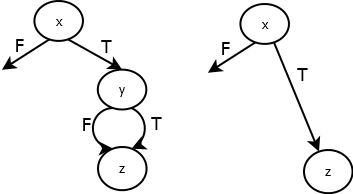
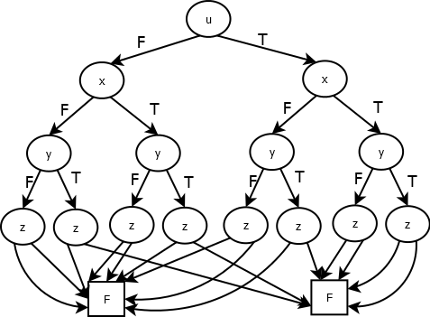
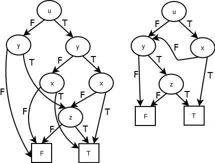
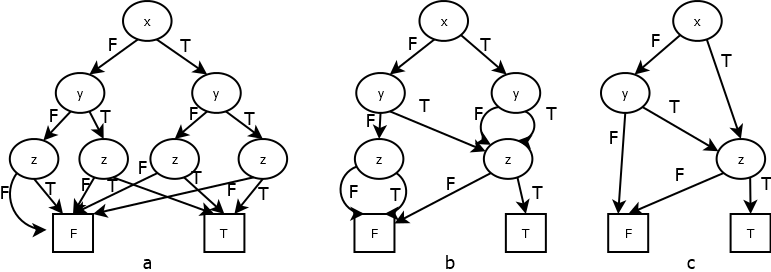

Робота №08
----------

*Впорядковані дерева*

Математичне означення впорядкованого дерева T -- це скінченна множина
вузлів, серед яких є один відокремлений вузол -- корінь дерева, а інші
вузли утворюють впорядкований список непересічних множин T~1~, ..., T~n~
і кожна з цих множин в свою чергу є впорядкованим деревом.

В Haskell впорядковані дерева (multi-way trees або *rose trees*)
задаються в бібліотеці Data.Tree типами: *Tree a*, a --тип значень у
вузлах дерева, і *Forest a* - ліс впорядкованих дерев. Кожне
впорядковане дерево (*Node v tx)* містить *v* -- значення в корені та
*tx* -- список (ліс) впорядкованих піддерев.

***data*** Tree a = Node {rootLabel :: a, subForest :: Forest a}

***type*** Forest a = \[Tree a\]

Властивості впорядкованих дерев:

-   Кожне дерево не порожнє (має хоча б один вузол)

-   Кожний вузол дерева має 0, 1, 2, 3, ... синів

-   Всі сини одного вузла утворюють список (впорядковані)

{width="1.3402777777777777in"
height="1.1208333333333333in"}{width="0.49722222222222223in"
height="1.132638888888889in"}{width="0.49583333333333335in"
height="0.6979166666666666in"}

Приклади впорядкованих дерев

ot1, ot2, ot3 :: Tree Char

ot1 = Node 'A' \[\]

ot2 = Node 'A' \[Node 'B' \[\]\]

ot3 = Node 'A' \[Node 'B' \[\], Node 'C' \[\]\]

Ліс впорядкованих дерев можна обійти в глибину і в ширину.

Обхід в глибину починається з кореня першого дерева і на кожному кроці
здійснюється обхід в максимально можливу глибину до переходу на наступну
вершину.

-   Проходиться корінь першого дерева

-   Проходиться в глибину ліс синів першого дерева.

-   Проходиться в глибину ліс дерев, що залишилися.

При обході в ширину вузли проходяться рівень за рівнем, починаючи з
коренів дерев списку. N-й рівень дерев -- це всі вузли з висотою N.
Кожен рівень обходиться зліва направо.

Двійкове (бінарне) дерево *BTree* означається рекурсивно як множина
вершин, що є порожньою (*BEmpty*) або (*BNode v tl tr*) складається з
виділеної вершини (кореня) *v* та двох двійкових дерев -- лівого *tl* і
правого *tr* піддерев*.*

***data*** BTree a = BEmpty \| BNode a (BTree a) (BTree a)

deriving (Show, Eq)

Властивості двійкових дерев:

-   {width="0.4479166666666667in"
    height="0.8104166666666667in"}{width="0.9020833333333333in"
    height="1.28125in"}{width="1.21875in"
    height="1.2604166666666667in"}Двійкове дерево може бути порожнім

-   Кожний вузол має 0, 1 або 2 синів

-   Розрізняють лівого і правого синів.

Приклади двійкових дерев

bt0, bt1, bt2, bt3 :: BTree Char

bt0 = BEmpty

bt1 = BNode 'A' BEmpty BEmpty

bt2 = BNode 'A' BEmpty (BNode 'B' BEmpty BEmpty )

bt3 = BNode 'A' (BNode 'B' BEmpty BEmpty ) (BNode 'C' BEmpty BEmpty )

Між списками впорядкованих дерев і двійковими деревами існує
взаємно-однозначна відповідність. (*Див. Д.Кнут. Искусство
программирования для ЭВМ. Т.1 Основные алгоритмы. 2.2.Деревья.*)

Неформально перехід від списку впорядкованих дерев до еквівалентного
двійкового дерева описує наступна процедура:

-   З"єднуються разом сини кожної сім"ї

-   Залишаються зв'язки від батька до старшого сина

-   Виконується поворот на 45 градусів

Наступні -- список впорядкованих дерев otx і двійкове дерево bt -
еквівалентні.

{width="3.59375in" height="1.625in"}

{width="2.6145833333333335in"
height="3.1770833333333335in"}

*Впорядковане дерево otx.*

{width="3.5208333333333335in"
height="1.5520833333333333in"}

*Двійкове дерево bt.*

Наступні -- список впорядкованих дерев і двійкове дерево - еквівалентні.

otx :: \[Node Int\]

otx = \[ Node 1 \[Node 2 \[\],

Node 3 \[Node 10 \[\]\] \] ,

Node 4 \[Node 5 \[Node 8 \[\]\],

Node 6 \[Node 9 \[\]\],

Node 7 \[\]\]

\]

bt :: BTree Int

bt = BNode 1 (BNode 2 BEmpty

(BNode 3 (BNode 10 BEmpty BEmpty)

BEmpty)

)

(BNode 4 (BNode 5 (BNode 8 BEmpty BEmpty)

(BNode 6 (BNode 9 BEmpty BEmpty)

(BNode 7 BEmpty BEmpty)

)

)

BEmpty

)

Двійкове дерево можна обійти в прямому (preorder), центрованому
(inorder) або зворотному порядках (postorder).

Центрований обхід дерева:

-   Пройти лівого піддерева.

-   Пройти корінь.

-   Пройти правого піддерева.

Двійкове дерево *BTree* , кожне піддерево (*BNode v tl tr*) якого з
коренем *v*, лівим *tl* та правим *tr* синами має властивість: якщо
вузол *u* належить *tl*, то *u ≤ v*, а якщо належить *tr*, то *u \> v*,
називається двійковим деревом пошуку. Зауважимо, що двійкове дерево
пошуку може містить в своїх вузлах однакові значення, тому його можна
використовувати для представлення мультимножини.

Двійкові дерева пошуку дозволяють досить ефективно реалізувати операції
пошуку, додавання і вилучення елементу

При центрованому обході двійкового дерева пошуку отримується
впорядкований список у неспадаючому порядку.

Остання властивість використовується для сортування списку,
використовуючи двійкове дерево пошуку:

-   Береться порожнє двійкове дерево пошуку.

-   Всі елементи списку послідовно додаються у двійкове дерево пошуку.

-   Двійкове дерево проходиться в центрованому порядку.

На основі допоміжного файлу, котрий включає визначення типів, допоміжних
функцій і даних для тестування, створити файл, в якому надати визначення
наступних функцій.

1.  Функція *dfsForestt lt* , котра формує список елементів, що
    знаходяться в вузлах списку (лісу) впорядкованих дерев, в порядку
    обходу списку дерев в глибину .

2.  Функція *bfsForest lt*, котра формує список елементів, що
    знаходяться в вузлах списку (лісу) впорядкованих дерев *lt* в
    порядку обходу списку дерев в ширину.

3.  Предикат *isInTree tr1 tr2 -* перевіряє чи являється впорядковане
    дерево *tr1*піддеревом іншого впорядкованого дерева *tr2.*

4.  Функція *toBTree lt,* котра за списком впорядкованих дерев *lt*
    будує відповідне двійкове дерево.

5.  Функція *fromBTree bt,* котра за двійковим деревом *bt* будує
    відповідний список впорядкованих дерев.

6.  Предикат *isSearch tr*, котрий перевіряє чи являється двійкове
    дерево *tr* -- двійковим деревом пошуку.

7.  Предикат *elemSearch tr v,* котрий перевіряє чи містить двійкове
    дерево пошуку *tr* вузол зі значенням *v*.

8.  Функція *insSearch tr v,* котра вставляє в двійкове дерево пошуку
    *tr* новий вузол зі значенням *v*, отримуючи нове двійкове дерево
    пошуку.

9.  Функція *delSearch tr v,* котра вилучає з двійкового дерева пошуку
    *tr* один з вузлів зі значенням *v*, отримуючи нове двійкове дерево
    пошуку. Якщо дерево *tr* не має вузла зі значенням *v*, то воно не
    змінюється.

10. Функція *sortList l*, котра сортує список *l*, використовуючи
    двійкове дерево пошуку.

*dfsForest* :: Forest a -\> \[a \]

*bfsForest* :: Forest a -\> \[a \]

*isInTree* :: (Eq a) =\> Tree a -\> Tree a -\> Bool

*toBTree* :: Forest a -\> BTree a

*fromBTree* :: BTree -\> Forest a

*isSearch* :: (Ord a) =\> BTree a -\> Bool

*elemSearch* :: (Ord a) =\> BTree a -\> a -\> Bool

*insSearch* :: (Ord a) =\> BTree a -\> a -\> BTree a

*delSearch* :: (Ord a) =\> BTree a -\> a -\> BTree a

*sortList* :: (Ord a) =\> \[ a\] -\> \[a \]

Зауваження:

Назва файлу Family08.hs (Family -- прізвище студента). Файл включає
модуль Family08 і створюється на основі файла-заготовки HWI08.hs
