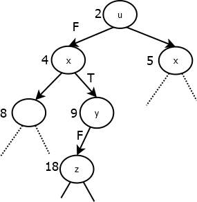

Робота №09
----------

Суфіксні дерева

*Задача зіставлення рядків -* чи з'являється заданий рядок пошуку *s* в
(зазвичай набагато довшому) текстовому рядку *t* і якщо да, то де.
Наприклад, рядок *t = "i miss mississippi"* містить шість входжень
(під)рядка *"s"* (індекси 4, 5, 9, 10, 11, 13), три *"is"* (індекси 3,
8, 11), два *"issi"* (індекси 8, 11), індекси нумеруються з 0.

Простий спосіб пошуку в текстовому рядку *t* для рядка пошуку *s* - це
обробляти зліва направо *t*, аналізуючи всі його суфікси. Якщо *s* є
префікс довільного з цих суфіксів, то *s* знаходиться в середині t. (Час
пошуку пропорційний добутку довжин *t* і *s*)

{width="2.9583333333333335in"
height="2.1458333333333335in"}Якщо для текстового рядка *t* побудувати
суфіксне дерево, то час пошуку в ньому рядка *s* пропорційний лише
довжині *s.* На Мал.1 і Мал.2 наведені суфіксні дерева для рядків
"banana" і "mississippi".

{width="5.270833333333333in"
height="2.2916666666666665in"}*Мал.1. Суфіксне дерево для «banana».*

*Мал.2 Суфіксне дерево для «mississippi»*

***data*** SuffixTree = Leaf Int \| Node \[(String, SuffixTree)\]

deriving (Eq,Ord,Show)

*Суфіксне дерево* для рядка s містить внутрішні вузли та вузли листки.
Кожний листок суфісного дерева містить ціле число - індекс в s. Кожне
під-дерево внутрішнього вузла помічається рядком. *Властивість
суфіксного дерева* - конкатенація міток під-дерев на шляху від кореня
дерева до листка представляє точно один суфікс s, індекс цього суфікса і
зберігається в листку. Шлях, що відвідує мітки під-дерев s~1~, s~2~,
..., s~k~ позначається s~1~-\> s~2~ -\> ... -\> s~k~.

Кожний внутрішній вузол представляє під-рядок, що повторюється.
Наприклад, вузол помічений чорним кольором на Мал. 2 відповідає шляху
"s" -\> "si", тобто під-рядку "ssi". Цей під-рядок з'являється двічі в
"mississipi": в суфіксах "ssissipi" (індекс 2) і "ssipi" (індекс 5).

Розглянемо суфіксне дерево для рядка t. Щоб знайти довільні входження
підрядка s в рядок t, s порівнюється з рядками, що являються мітками
кожного під-дерева, на які посилається корінь дерева. Нехай одне з них
має мітку a, тоді:

-   Якщо s є префікс a, тоді він є префікс *кожного* суфікса, що
    індексує листки такого під-дерева. Необхідні індекси розміщуються в
    листках цього під-дерева.

-   Якщо a є префікс s тоді пошук потрібно продовжити далі в цьому
    під-дереві, після вилучення префіксу a з s.

-   Якщо не s і не a - не являються префіксами одне одного, тоді
    необхідно перейти до наступного під-дерево, якщо воно є.

Простий спосіб побудувати суфіксне дерево для рядка s -- додати кожний
суфікс рядка s по порядку, починаючи з найдовшого (тобто самого рядка
s). Функція, що будує дерево таким чином надається в допоміжному файлі,
і має вид:

buildTree :: String -\> SuffixTree

buildTree s

= foldl (flip insert) (Node \[\]) (zip (suffixes s) \[0..\])

Головну роботу виконує функція insert (s, n) st, котра додає суфікс s з
індексом n в частково побудоване суфіксне дерево st.

Щоб вставити пару (s,n) у дерево ) st, потрібно перевірити кожне
помічене піддерево кореня по порядку. Розглянемо піддерево t з міткою a:

-   Якщо s і a не мають спільного префіксу, то перейти до наступного
    піддерева.

-   Якщо s і a мають спільний префікс p і p=a (тобто a є префікс p), то
    потрібно вставити скорочений підрядок s-p (s вилучається спільний
    префікс p. ) в t.

-   Якщо s і a мають спільний префікс p і p≠a, то a замінює p і t
    замінюється новим вузлом з двома піддеревами: одне помічене s-p,
    веде до листка з індексом n, і іншим буде t з новою міткою a-p.

-   Якщо жодна мітка піддерев не має спільного префіксу з s, то список
    піддерев розширюється додаванням нового вузла-листка поміченого s з
    індексом n.

В допоміжному файлі, котрий включає визначення типів, допоміжних функцій
і даних для тестування, надати визначення наступних функцій.

1.  Функція *isPrefix s1 s2*, котра повертає True якщо *s1* є префікс
    *s2*. Наприклад:

    -   isPrefix "has" "haskell" = True

    -   isPrefix "" "haskell"= True

    -   isPrefix "ask" "haskell" = False

2.  Функція *partition s1 s2,* котра знаходить найбільший спільний
    префікс рядків *s1* і *s2*, повертаючи префікс і результат вилучення
    спільного префіксу з обох рядків. Наприклад:

    -   partition "happy" "haskell" = ("ha","ppy","skell")

3.  Функція *suffixs s*, що повертає список всіх суфіксів рядка *s* в
    порядку зменшення довжини. Можна повторно застосувати функцію
    *tail*. Наприклад:

    -   suffixes "perl" = \["perl","erl","rl","l"\]

4.  Функція *isSubstring s1 s2*, котра повертає True тоді і тільки тоді,
    коли рядок *s1* є підрядок *s2*. Можна використати функції
    *isPrefix* і *suffixs*. Наприклад.

    -   isSubstring "ho" "python" = True

    -   isSubstring "thong" "python" = False

5.  Функція *findSubstrings* *s1 s2* ,котра повертає індекси всіх
    входжень рядка *s1* в рядок *s2* в довільному порядку*.* Якщо немає
    жодного входження функція повертає \[\]. Використати функції
    *isPrefix* і suffixes. Наприклад:

    -   findSubstrings "an" "banana" = \[1,3\]

    -   findSubstrings "s" "mississippi" = \[2, 3, 5,6\]

6.  Функція *getIndices st*, котра повертає значення (індекси) що
    зберігаються в листках суфіксного дерева *st*. Наприклад:

    -   getIndices (Node \[("",Leaf 4) , ("", Leaf 1)\]) = \[1,4\]

    -   getIndices t1 = \[0,1,2,3,4,5\]

7.  Функція *findSubstrings'* *s st,* котра повертає індекси всіх
    входжень рядка *s* в суфіксне дерево *st.* Наприклад:

    -   findSubstrings' "an" t1 = \[1, 3\]

    -   findSubstrings' "s" t2 = \[2, 3, 5, 6\]

8.  Функція *insert (s,n) st*, котра вставляє заданий суфікс *s*, зі
    зв'язаним індексом *n*, в суфіксне дерево *st*. Наприклад, якщо
    *insert* вірно визначена, то:

    -   findSubstrings' "an" (buildTree s1) = \[1, 3\]

    -   findSubstrings' "s" (buildTree s2) = \[2, 3, 5, 6\]

9.  Функція *longestRepeatedSubstring st*, котра знаходить для
    суфіксного дерева *st,* побудованого за рядком *t*, найдовший
    підрядок, що зустрічається два або більше разів (можливо з
    перетином) в рядку *t*. Якщо є більше ніж один найдовший рядок, що
    повторюється, наприклад "miss" і "issi" в "missmississippi", то
    повертається довільний*.* Наприклад:

    -   longestRepeatedSubstring (buildTree "mississippi") = "issi"

isPrefix :: String -\> String -\> Bool

partition :: Eq a =\> \[a\] -\> \[a\] -\> (\[a\], \[a\], \[a\])

suffixes :: \[a\] -\> \[\[a\]\]

isSubstring :: String -\> String -\> Bool

findSubstrings :: String -\> String -\> \[Int\]

getIndices :: SuffixTree -\>\[ Int\]

findSubstrings' :: String -\> SuffixTree -\> \[Int\]

insert :: (String, Int) -\> SuffixTreee -\> SuffixTree

longestRepeatedSubstring :: SuffixTree -\> String

Зауваження:

Назва файлу Family09.hs (Family -- прізвище студента). Файл включає
модуль Family09і створюється на основі файла-заготовки HWI09.hs
