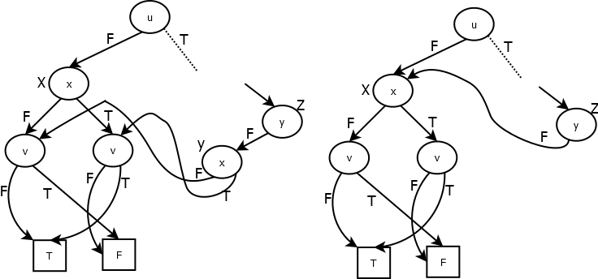

Робота №11
----------

Бінарні діаграми рішень

*Булеві вирази* включають булеві константи *T (True)* і *F (False)*,
булеві змінні (тобто *x, y,* ...), заперечення (!) і бінарні операції
(&) і (\|), котрі мають звичайну семантику (Таб.1)

  *A*       *b*       *a & b*   *a \| b*
  --------- --------- --------- ----------
  *False*   *False*   *False*   *False*
  *False*   *True*    *False*   *True*
  *True*    *False*   *False*   *True*
  *True*    *True*    *True*    *True*

  *a*       *!a*
  --------- ---------
  *False*   *True*
  *True*    *False*

*Таб.1 Таблиці істини (здійсненності) для !, & і \|*

Наступні БНФ повністю описують синтаксис булевих виразів

*\<bsym\> ::= \'a\' \| \... \| \'z\' \...довільна мала буква латинського
алфавіту*

*\<bdis\> ::= \<bsym\> \| \'(\' \<bexp\> \')\' \| \'!\' \<bdis\> \|
\'T\' \| \'F\'*

*\<bcon\> ::= \<bdis\> \<manyDis\>*

*\< manyDis\> ::= \'&\' \<bdis\> \<manyDis\> \| ""*

*\<bexp\> ::= \<bcon\> \<manyCon\>*

*\<manyCon\>::= \'\|\' \<bcon\> \<manyCon\> \| ""*

*\<fullBexp\> ::= \<bexp\> 'eos'*

Булевий вираз можна представити у вигляді бінарної діаграми рішення.
*Бінарна діаграма рішення (БДР)* - це орієнтований ациклічний граф,
котрий дуже схожий на бінарне дерево, що кодує всі можливі значення
булевих змінних, що входять у вираз. Граф містить внутрішні вузли, що
позначаються малими буквами -- імена змінних і мають правого і лівого
сина, лівий син завжди відповідає *False* і правий син *True*. Кожний
шлях в графі представляє унікальний набір значень всіх змінних виразу і
веде від кореня до вузла листка, котрий представляє *False* або *True
--* значення булевого виразу при відповідному наборі значень змінних.
Якщо різні змінні з'являються в тому ж порядку на всіх шляхах від
кореня, то бінарна діаграма рішення -- впорядкована.

Мал.1 показує дві впорядковані БДР для виразу !(x & (F \| y )) : зліва -
змінні з'являються в порядку \[x, y\] зверху до низу , справа - змінні
з'являються в порядку \[y, x\].

Листки F і T - це скорочення для *False* і *True, буква, що* зв'язана з
кожним внутрішнім вузлом, є ім\`я змінної.

{width="3.7916666666666665in"
height="1.625in"}

*Мал.1.* *Два повні БДР для !(x & (F \| y ))*

Булеві вирази і БДР в Haskell можна задати наступними типами даних

.

***data*** BExp = Bvalue Bool \| Bvar Char \| Not BExp \| And BExp BExp
\| Or BExp BExp

deriving (Eq, Ord, Show)

***type*** Env = \[(Char, Bool)\]

***type*** NodeId = Int

***type*** BDDNode = (NodeId, (Char, NodeId, NodeId))

***type*** BDD = (NodeId, \[BDDNode\])

Булевий вираз *! (x & (F \| y ))* можна представити так:

Not (And (Bvar 'x') (Or (Bvalue False) (Bvar 'y')))

Дані типу Env використовуються для задання конкретного набору значень
булевих змінних

Ідентифікатори вузлів (NodeId) в БДР повинні бути унікальними. Вузли
листки явно не включаються в представлення БДР. Замісто цього,
резервуються мітки 0 і 1, котрі будуть використовуватися для
«невидимих», але завжди-присутніх *False* і *True* відповідно.

БДР на Мал. 1 можна відповідно представити:

(2, \[(4, ('y',1,1)), (5, ('y',1,0)), (2, ('x',4,5))\])

(2 ,\[(2, ('y',7,3)), (7, ('x',1,1)), (3, ('x',1,0))\])

Головна ідея побудови за виразом БДР базується на розкладенні Шеннона.
Будь який булевий вираз по одній із змінних можна розділити на два
підвирази (підставляючи у вираз значення *False* і *True* відповідно і,
можливо, скорочуючи результат). Представляючи кожний такий вираз у
вигляді піддерева і продовжуючи розкладання по решті вхідних змінних
можна отримати БДР.

Побудувати БДР за бульовим виразом *e* з урахуванням порядку змінних, що
задається списком *xs*, може наступна функція *buildBDD e xs*, що
використовує допоміжну функцію *buildBDD' e 2 xs.*

buildBDD :: BExp -\> \[Char\] -\> BDD

buildBDD e xs = buildBDD' e 2 xs

buildBDD' :: BExp -\> NodeId -\> \[Char\] -\> BDD

buildBDD' = undefined

NodeId -- це ідентифікатор, котрий потрібно присвоювати наступному вузлу
в БДР, що будуєте. Тому що ідентифікатори вузлів 0 і 1 вже зарезервовані
для представлення *False* і

*True* відповідно, то перший невикористаний ідентифікатор є 2.

{width="2.7291666666666665in"
height="2.0104166666666665in"}На кожному кроці побудови із списку
змінних *xs* вибирається перша, по якій вираз *e* ділиться на два
підвирази (розкладенні Шеннона), за якими рекурсивно будуються ліве і
праве піддерева. Коли список *xs* порожній (\[\]), то досягли листка
дерева. В цьому випадку повертаєте БДР виду (b,\[\]), де b або 0 або 1,
котра представляє *False* або *True* відповідно.

*Мал.2: Побудова БДР*

При побудови БДР потрібно щоб кожний вузол має унікальний ідентифікатор.
Один із способів: якщо вузол помічений n, то вузли корені лівого та
правого піддерев помічаються 2n і 2n+1 відповідно ( Мал. 2).

Повна впорядкована БДР, що будується за таким алгоритмом має структуру,
котру можна суттєво скоротити і отримати *скорочену впорядковану БДР.*
Скорочена БДР отримується в результаті застосування до повної БДР двох
правил:

-   Злиті вузли-дублікати («злиті будь які ізоморфні підграфи»).

    -   Якщо два вузли (m1,(i1,f1,t1)) і (m2,(i2,f2,t2)) відрізняються
        лише мітками, тобто m1≠m2, i1=i2, f1=f2, t1=t2, то один з цих
        вузлів (наприклад - m2) можна вилучити, а всі посилання на нього
        спрямувати на інший вузол (m1).

-   Вилучені лишні перевірки («вилучено будь який вузол, у якого обидва
    нащадки ізоморфні»).

    -   {width="6.159027777777778in"
        height="2.8402777777777777in"}Якщо у вузла (m,(i,f,t)), f= t, то
        його можна вилучити, а всі посилання на нього спрямувати на f.

    -   

> *Мал.3: Злиття вузлів-дублікатів («Злиття ізоморфних підграфів»)*

Перше -- злиття вузлів-дублікатів («спільне використання підграфів»)
всюди де це можливо. Приклад показано на Мал.3. Тут вузол, що помічено
як X, ідентичний вузлу поміченому як Y. Вузол Y можна вилучити і всі
посилання на нього спрямувати на X.

Друге -- вилучити лишню перевірку, тобто вузол який посилається двічі на
одне і те ж дерево, як показано на Мал.4

{width="3.0in"
height="1.4583333333333333in"}*Мал.4. Вилучення лишньої перевірки («У
вузла обидва нащадки ізоморфні»).*

Розмір БДР визначається як бульовим виразом, так і вибором порядку
змінних. На Мал.5 повна впорядкована БДР для виразу (u & x) \| (y & z).
На Мал.6 дві скорочені БДР для того ж виразу, що отриманні
використовуючи порядок індексів змінних \['u', 'y', 'x', 'z'\] і \['u',
'x', 'y', 'z'\].

В допоміжному файлі, котрий включає визначення типів, допоміжних функцій
і даних для тестування, надати визначення наступних функцій.

1.  Функція *checkSat bdd env*, котра повертає True якщо значення
    змінних задані в середовищі *env* задовольняють вираз, що відповідає
    БДР *bdd*. Наприклад:

    -   checkSat bdd2 \[('x',True),('y',False)\] = True

    -   checkSat bdd7 \[('y',True),('x',False),('e',True)\]= False

2.  Функція *sat bdd,* котра обчислює список всіх множин значень
    змінних, котрі задовольняють бульовий вираз, що відповідає БДР
    *bdd*. Кожна «множина» значень є список пар (Char, Bool). Наприклад:

    -   sat bdd1 = \[\]

    -   sat bdd2 =
        \[\[('x',False),('y',False)\],\[('x',False),('y',True)\],\[('x',True),('y',False)\]\]

    -   sat bdd8 = \[\[('u',False)\],\[('u',True)\]\]

    -   {width="4.6875in"
        height="2.9375in"}

> *Мал.5: Повна БДР для (u & x) \| (y & z)*
>
> {width="4.375in"
> height="2.3645833333333335in"}

*Мал.6: Скорочені БДР для (u & x) \| (y & z)*

3.  Нерекурсивна функція *simplify e*, що спрощує булевий вираз *e*,
    застосовуючи правила визначені в таблицях істини (Таб.1) у випадках
    коли аргумент (и) ¬, Ʌ і V є булеві константи (Bvalue False або
    Bvalue True). Якщо таких немає, то вираз повертається незмінним .
    Наприклад:

    -   simplify (Not (Bvalue False)) = Bvalue True

    -   simplify (Or (Bvalue False) (Bvalue False)) = Bvalue False

    -   simplify (And (Bvar 'y') (Bvalue True)) = And (Bvar 'y') (Bvalue
        True)

4.  Функція *restrict e x v*, котра замінює вказану змінну (символ *x*)
    у виразі *e*, на булеву константу *v*. Заміна може дозволити
    застосувати одно або більше правил спрощення, тому потрібно
    викликати *simplify* кожний раз, коли будується новий Not, And або
    Or вираз. Наприклад.

    -   restrict b7 'x' True = Or (Not (Bvar 'y')) (Or (Bvalue True)
        (Not (Bvar 'e')))

    -   restrict (restrict b7 'x' True) 'e' False = Or (Not (Bvar 'y'))
        (Bvalue True)

    -   restrict (restrict (restrict b7 'x' True) 'e' False) 'y' True =
        Bvalue True

5.  Допоміжна функція *builBDD' e n xs*, котра будує БДР за бульовим
    виразом *e* з урахуванням порядку змінних, що задається списком
    *xs*; *n -* це ідентифікатор наступного вузла в БДР, що будується.
    Наприклад (з точністю до ідентифікаторів вузлів і порядку елементів
    у списку):

    -   buildBDD b1 \[\] = bdd1

    -   buildBDD' b2 2 \['x', 'y'\] = bdd2

    -   buildBDD b4 \['x','y','d'\] = bdd4

6.  Функція *buildROBDD e xs*, котра будує скорочену впорядковану БДР за
    бульовим виразом *e* з урахуванням порядку змінних, що задається
    списком *xs,* застосовуючи наведені раніше оптимізації до БДР, що
    будується функцією buildBDD. Наприклад (з точністю до
    ідентифікаторів вузлів і порядку елементів у списку):

    -   buildROBDD b6 \['u','x','y','z'\] =
        (5,\[(5,(\''u',3,4)),(3,('y',0,2)),(2,('z',0,1)),(4,('x',3,1))\])

    -   buildROBDD b6 \['u','y','x','z'\] =
        (7,\[(7,('u',3,6)),(3,('y',0,2)),(2,('z',0,1)),(6,('y',4,5)),(4,('x',0,1)),(5,('x',2,1))\])

7.  Функція *fullBexp s*, котра виконує синтаксичний аналіз булевого
    виразу в рядку *s*, повертаючи *Just be*, де *be* -- розпізнаний
    булевий вираз або *Nothing*. Можна створити набір додаткових
    рекурсивних аналізаторів bdis, manyDis, bcon, manyCon, bexp, котрі
    розпізнають синтаксичні конструкції *bexp, bcon, bdis :: String -\>
    Maybe (BExp,String)*. Наприклад:

    -   *fullBexp bs7 = Just b7*

    -   *fullBexp " F\|x(y) " = Nothing*

checkSat :: BDD -\> Env -\> Bool

sat :: BDD -\> \[\[(Char, Bool)\]\]

simplify :: BExpr -\> BExpr

restrict :: BExp -\> Char -\> Bool -\> BExpr

buildBDD' :: BExp -\> NodeId -\> \[Char\] -\> BDD

buildROBDD :: BExp -\> \[Char\] -\> RDD

fullBexp :: String -\> Maybe BExpr

{width="6.496527777777778in"
height="2.2916666666666665in"}

*Мал.7: Побудова скороченої впорядкованої СВБДР для z & (y \| (!y & x)):
повна БДР (a), злиття вузлів-дублікатів (b), вилучення лишніх перевірок
(c).*

Зауваження:

Назва файлу Family11.hs (Family -- прізвище студента). Файл включає
модуль Family1 і створюється на основі файлу-заготовки HWI11.hs
